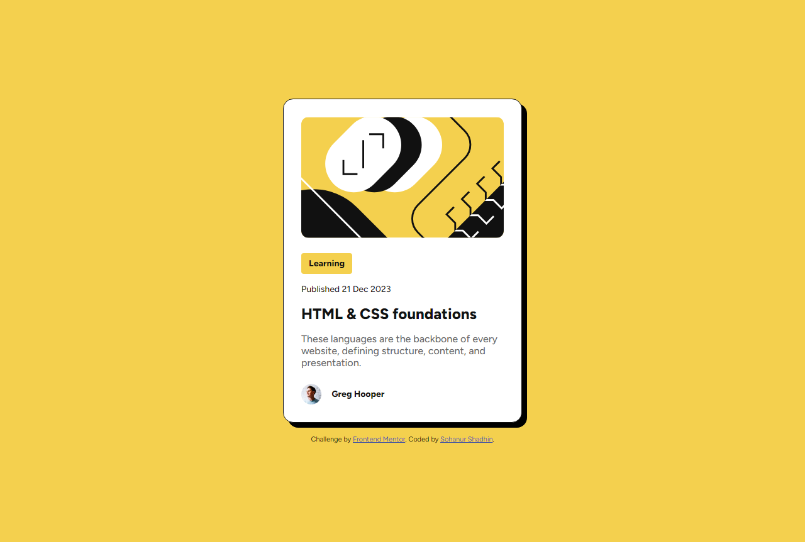
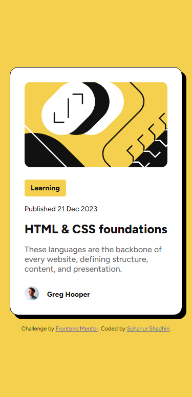

# Frontend Mentor - Blog preview card solution

This is a solution to the [Blog preview card challenge on Frontend Mentor](https://www.frontendmentor.io/challenges/blog-preview-card-ckPaj01IcS). Frontend Mentor challenges help you improve your coding skills by building realistic projects. 

## Overview

### The challenge

Users should be able to:

- View the optimal layout for the section depending on their device's screen size
- Creative Design of Card Component
### Screenshots

### Links

- Solution URL: [Blog Preview Card](https://www.frontendmentor.io/solutions/blog-preview-card-sHa8XRFTxJ)
- Live Site URL: [Blog Preview Card](https://fm-blog-preview-card-main-nine.vercel.app/)

## My process

### Built with

- Modern HTML5 markup
- CSS custom properties
- CSS custom variables
- Flexbox - make contents flexiblity
- Mobile-first workflow - responsive design

### What I learned

You have to build a organized markup in html to design it with css as your desire.
And use CSS Flexbox to design web page devices responsive in next.
Also use vales in 'rem' instead of 'px'

### Continued development

You have to learn continous to improve your design.

## Author

- Frontend Mentor - [@ShadhinForever](https://www.frontendmentor.io/profile/ShadhinForever)
